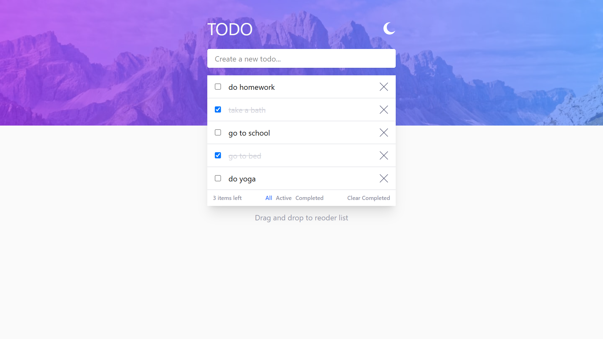

# todo-app

This is a solution to the [Todo app challenge on Frontend Mentor](https://www.frontendmentor.io/challenges/todo-app-Su1_KokOW). Frontend Mentor challenges help you improve your coding skills by building realistic projects. 

## Table of contents

- [Overview](#overview)
  - [The challenge](#the-challenge)
  - [Screenshot](#screenshot)
  - [Links](#links)
- [My process](#my-process)
  - [Built with](#built-with)
  - [What I learned](#what-i-learned)
  - [Continued development](#continued-development)
  - [AI Collaboration](#ai-collaboration)
- [Author](#author)

## Overview

### The challenge

Users should be able to:

- View the optimal layout for the app depending on their device's screen size
- See hover states for all interactive elements on the page
- Add new todos to the list
- Mark todos as complete
- Delete todos from the list
- Filter by all/active/complete todos
- Clear all completed todos
- Toggle light and dark mode
- **Bonus**: Drag and drop to reorder items on the list

### Screenshot




### Links

- Solution URL: [Add solution URL here](https://www.frontendmentor.io/solutions/todo-app-H0UAiARFO5)
- Live Site URL: [Add live site URL here](https://todo-app-kdev.onrender.com/)

## My process

### Built with

- [React](https://reactjs.org/) - JS library
- Tailwindcss
- Node.js/Express.js
- MongoDB

### What I learned

Use this section to recap over some of your major learnings while working through this project. Writing these out and providing code samples of areas you want to highlight is a great way to reinforce your own knowledge.

To see how you can add code snippets, see below:


```js
const dragIndex = useRef();

const handleDragStart = (todo) => {
    dragIndex.current = todo;
  };

  const handleDrop = (dropTodo, dropIndex) => {
    const list = filteredList;
    const draggedTodo = dragIndex.current;

    if (draggedTodo._id === dropTodo._id) return;

    // Biết hướng kéo
    const draggedIndex = list.findIndex((t) => t._id === draggedTodo._id);
    const draggingDown = draggedIndex < dropIndex;

    let prevOrder, nextOrder;

    if (draggingDown) {
      // Kéo xuống: item thả vào trở thành prev, item sau nó là next
      prevOrder = list[dropIndex].order;
      nextOrder =
        dropIndex < list.length - 1 ? list[dropIndex + 1].order : null;
    } else {
      // Kéo lên: item trước vị trí thả là prev, item thả vào là next
      prevOrder = dropIndex > 0 ? list[dropIndex - 1].order : null;
      nextOrder = list[dropIndex].order;
    }

    let newOrder;
    if (prevOrder === null) {
      newOrder = nextOrder - 1;
    } else if (nextOrder === null) {
      newOrder = prevOrder + 1;
    } else {
      newOrder = (prevOrder + nextOrder) / 2;
    }

    onReorderTodoMutation(draggedTodo._id, newOrder);
  };
```

### Continued development

- Auth, zustand, and more features to make it a full-fledged app.

### AI Collaboration

Describe how you used AI tools (if any) during this project. This helps demonstrate your ability to work effectively with AI assistants.

- Claude
- debugging code and learning new concepts
- I learned how to use Claude to help me debug my code and learn new concepts. I also used it to generate code snippets and explanations for certain features in my project.


## Author

- Frontend Mentor - [@yourusername](https://www.frontendmentor.io/profile/K-DevGrowth)
- Youtube - [@Kdev6](https://www.youtube.com/@Kdev6)
